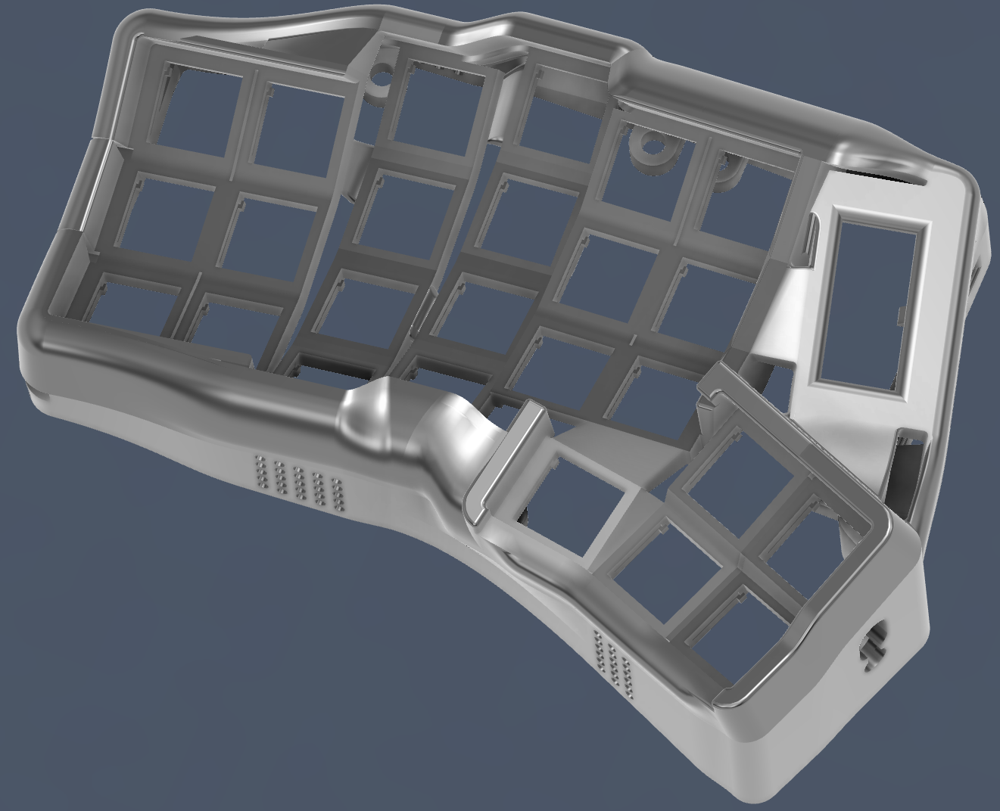
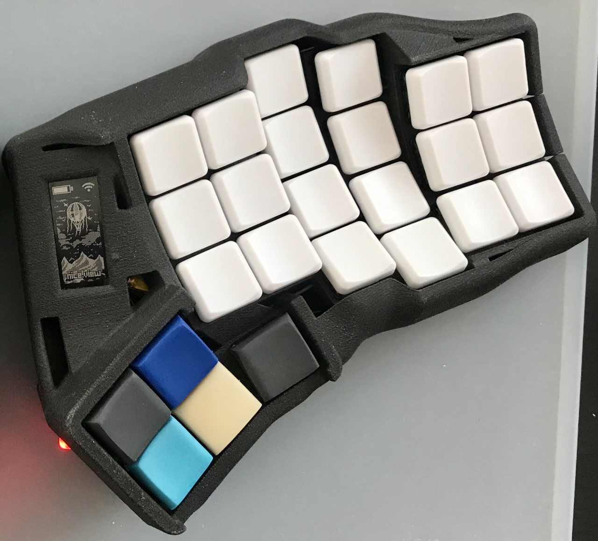
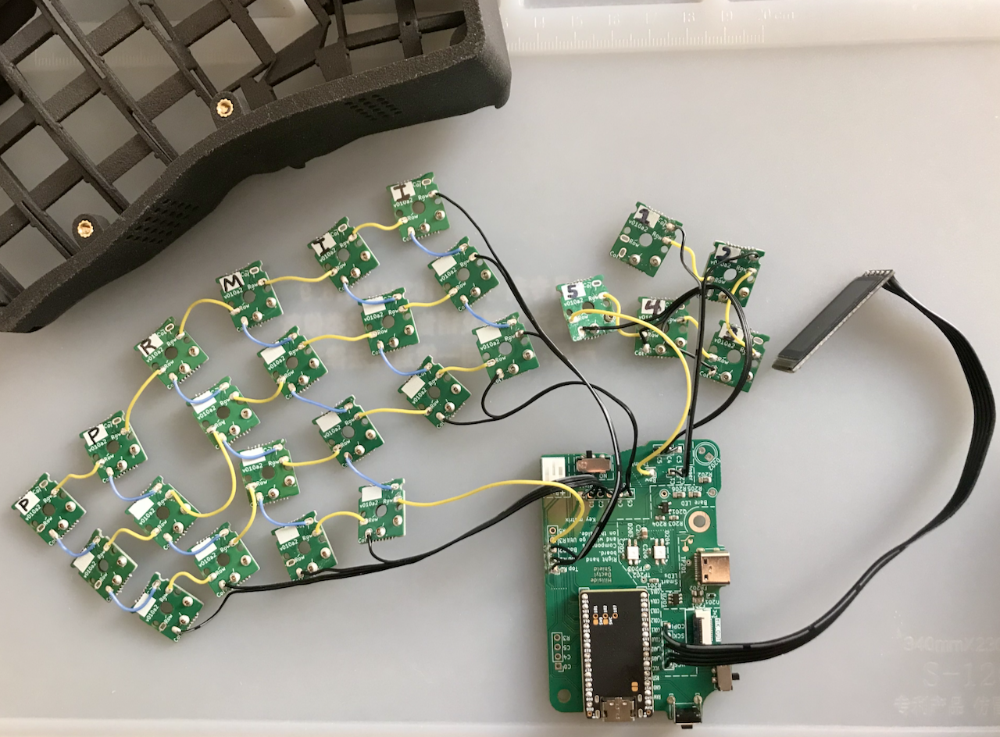
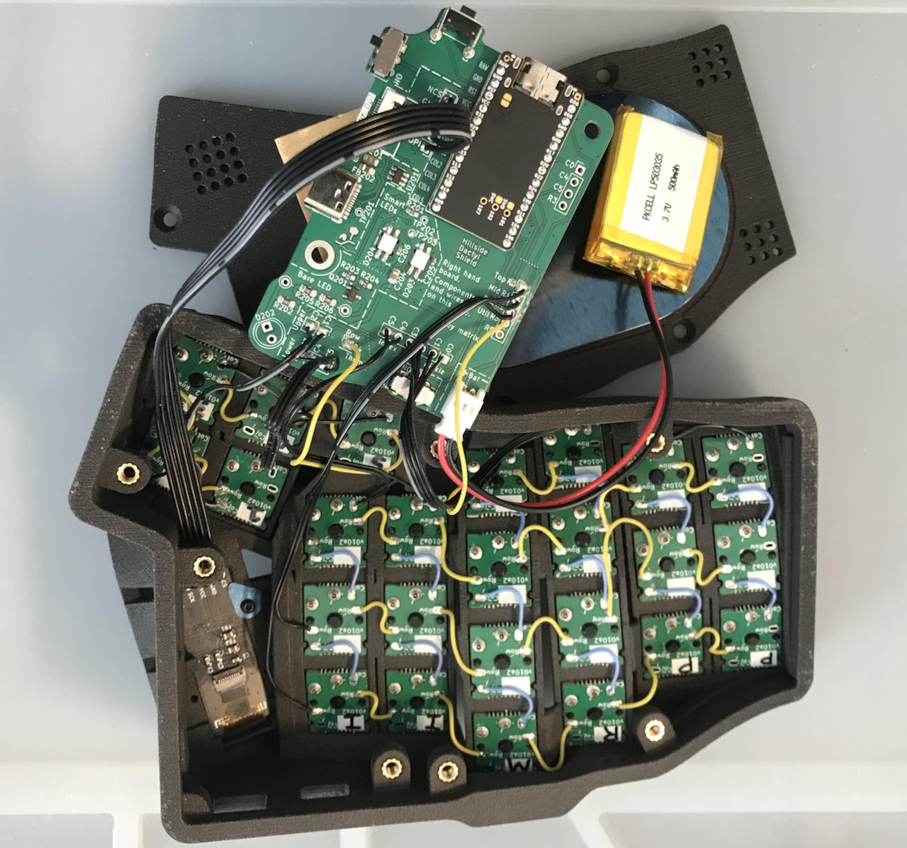

# Hillside Dactyl 50

|                 |                 |
|:-----------     |:----------------|
|  |  |
|  | |

The Hillside Dactyl 50 is a small contoured-keywell ergonomic keyboard
    with three choc-spaced rows of six per side.
This repository has the [body files](./stl/),
    and describes parts and assembly in the 
    [wiki](https://github.com/mmccoyd/hillside_dactyl_50/wiki).

Two other repositories have the PCB files

-   [Amoeba Choc14](https://github.com/mmccoyd/hillside_amoeba_choc14)
    to wire the switches and diodes to create the key matrix.
-   [Hillside Dactyl Shield](https://github.com/mmccoyd/hillside_dactyl_shield)
    to connect the MCU, keys, display, and LEDs.

Though still in development, it has been reliable and comfortable.
See the [Chgange log](./ChangeLog.md) for known issues, but
    I hope you find the board useful.

## Features

-   Three main rows of six, a lower row of two, five thumb keys, and 50 keys
    total.
-   A keywell with 15° column curve, and 15° tent built in.
-   A [Dactyl](https://github.com/adereth/dactyl-keyboard) style thumb cluster
    with a pressing-down motion not a
    gripping one.
-   Choc 18 x 17 mm spacing.
-   Wireless focused, yet with a wired split USB-C with ESD protection.
-   An external switches header for foot pedals, but case drilling would be
    needed.
-   Default key maps for
    [ZMK](https://github.com/mmccoyd/zmk-hillsideD50) as an external module and
    [QMK](https://github.com/mmccoyd/qmk_firmware/tree/hillside_d50/keyboards/hillside/d50)
    as a branch on a fork.

### Non-Features

-   Switch insertion or replacement externally.
    The case needs to be open to press the amoebas up onto the switches.
    The switches snap into the case, but the amoeba don't.
    The amoeba are held in place by a tight grip on the switch's plastic posts.
    Switches popping out is rare when dropped, but is possible.
    Iterating on this is on my list of longer term items.
-   Per key RGB.
    The amoebas don't have much space.
    It would be cool and might be possible, but is low on my personal
    priority list.

## Future

Eventually there will be a breaking change between the case and shield
    to improve the USB holes,
    to accept more plug variation on the side and eliminate the
    recess in the back.
In both cases by having the shield push the USB further into the inner wall.
But this needs more fit modeling and testing, so it will be a while.

For non-breaking changes:
the display corner can be smoother and less protruding,
spots for front magnets would allow a palm rest,
and a CNC steel bottom plate would give a wider base for tenting adjustments
    and could lower the height a few mm.

## License

This work is licensed under a
[Creative Commons Attribution-NonCommercial-ShareAlike 4.0 International](
https://creativecommons.org/licenses/by-nc-sa/4.0/) license.

## See also

This Dactyl evolved from my flat
    [Hillside keyboards](https://github.com/mmccoyd/hillside),
    which may be an easier start for those new to small choc-spaced ergonomic
    boards.

Some background on the benefits of
    [split contoured-keywells](https://www.ergocanada.com/detailed_specification_pages/kinesis_corporation_advantage360_pro_contoured_keyboard.html#benefits)
    and [small keyboards](https://40s.wiki/en/why) may be helpful.

Some prebuild Dactyls include
    the larger [Kinesis Advantage 360](https://kinesis-ergo.com/shop/adv360pro/)
    and [MoErgo Glove 80](https://www.moergo.com/),
    while [Bastard Keyboards](https://bastardkb.com/) has prebuilt
    medium to small
    [Dactyl Manuforms](https://github.com/abstracthat/dactyl-manuform).
Some argue that the original
    [Dactyl](https://github.com/adereth/dactyl-keyboard)
    is gentler on the thumb joint and wrist than the
    [Dactyl Manuform](https://github.com/abstracthat/dactyl-manuform) is.
The Glove 80 is the only of these prebuilt with choc spaced switches, 
    which are nice for medium or smaller hands.

[Cosmos](https://ryanis.cool/cosmos/) is a nice generator for custom Dactyl
    Manuform bodies that can do choc vertical but not horizontal spacing;
    it also offers a prebuilt option.
The Cosmos cases are larger than the Hillside's, though that is also nice
    in making the case insides less cramped during the build.
YellowAfterlife's
    [ergonomic keyboard list](https://yal-tools.github.io/ergo-keyboards/)
    shows a few more contoured keywell options and many flat options.
