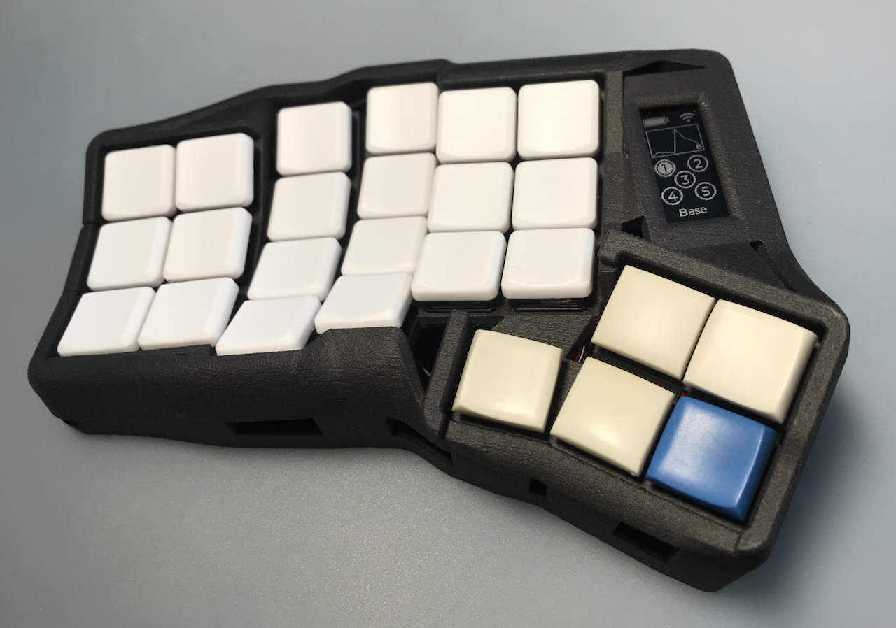

# Hillside Dactyl 50

This is the central repo for the Hillside Dactyl 50 ergonomic keyboard.
The [releases](https://github.com/mmccoyd/hillside_dactyl_50/releases)
    have the STEP files for the body and a few other parts,
    and the [wiki](https://github.com/mmccoyd/hillside_dactyl_50/wiki)
    describes parts and assembly.

The PCBs for it are in two other repositories.

-   [Hillside Dactyl Shield](https://github.com/mmccoyd/hillside_dactyl_shield)
    to connect the MCU, keys, display, and LEDs.
-   [Amoeba Choc14](https://github.com/mmccoyd/hillside_amoeba_choc14)
    to wire the switches and diodes to create the key matrix.

There is an easy [3D preview](./stl/Hillside_D50.stl) of the body.

## Features

-   Three main rows, a lower row of two keys, five thumb keys, and 50 keys
    total.
-   A keywell with 15° column curve, and 15° tent built in.
-   A Dactyl style thumb cluster with a pressing-down motion not a
    gripping one.
-   Choc 18 x 17 mm spacing.
-   Wireless focused, yet with a wired split USB-C with ESD protection.
-   An external switches header, but case drilling would be needed.

## Keymap

It has default [ZMK](https://github.com/mmccoyd/zmk-hillsideD50)
    and QMK key maps. 

## See also

This is the 3D evolution of the
[flat Hillside keyboards](https://github.com/mmccoyd/hillside).
Those may be an easier entry point for anyone new to small ergonomic boards.
